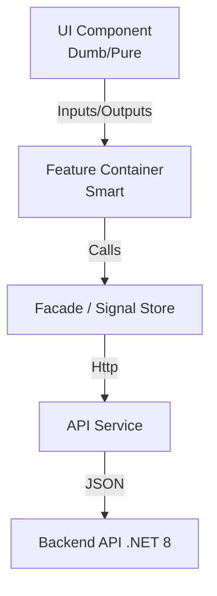

<div align="center">

# 🏢 Employee Management System (Enterprise)

[](https://angular.io/)
[](https://www.typescriptlang.org/)
[](https://ng.ant.design/)
[](https://angular.dev/guide/signals)
[](LICENSE)

**A high-performance, scalable Enterprise Application built with modern Angular Architecture.**
*Strict Typing • Signal Store • Unidirectional Data Flow • Feature-based Architecture*

[Features](#-features) • [Architecture](#-architecture) • [Getting Started](#-getting-started) • [Documentation](#-documentation)

</div>

---

## 🌟 Overview

This project demonstrates a **Production-Ready** approach to building large-scale Angular applications. It moves beyond standard tutorials by implementing strict Enterprise patterns:

- **Signal-based State Management**: No complex RxJS boilerplate for state. Granular updates with Angular Signals.
- **Strict Architecture**: Clear separation between `Features`, `UI (Dumb Components)`, and `Data Access (Smart Stores)`.
- **Type Safety**: 100% Strict Mode. Custom `AppError` handling.
- **Modern UX**: Ant Design components with optimized interactions (Skeleton loaders, Toasts).

## ✨ Features

### 👥 Employee Management (Core)
- **CRUD Operations**: Full Create, Read, Update, Delete lifecycle.
- **Reactive Forms**: Complex validation & dirty checking.
- **Smart Feedback**: Loading states (`isCreating`, `isUpdating`) & Optimistic UI updates.

### 🏢 Department & Designation (Master Data)
- **Relationship Mapping**: Employees linked to Departments & Designations.
- **Master Data Management**: Dedicated CRUD modules for organizational structure.
- **Dynamic Dropdowns**: Context-aware selection in forms.

## 🏗️ Technical Architecture

We follow a **Modular Feature Architecture** designed for scalability:



### Key Technologies
| Category | Stack | Description |
| :--- | :--- | :--- |
| **Framework** | Angular 21 | Standalone Components, Signals, Control Flow (`@if`, `@for`). |
| **State** | Signal Store | Custom lightweight store pattern (similar to NgRx SignalStore). |
| **UI Library** | Ant Design (NG-ZORRO) | Enterprise-class UI components. |
| **Styling** | SCSS / Bootstrap 5 | Utility classes & custom theming. |
| **Tooling** | Vitest, ESLint | Modern testing & linting. |

## 🚀 Getting Started

### Prerequisites
- Node.js `v18+`
- Angular CLI `v21+`

### Installation

```bash
# Clone the repository
git clone https://github.com/your-username/employee-manage-app.git

# Navigate to project
cd employee-manage-app

# Install dependencies
npm install

# Run development server
ng serve
```

Navigate to `http://localhost:4201/`.

## 📚 Documentation Index

| Doc | Description |
| :--- | :--- |
| [**PHASE_1_SUMMARY**](./PHASE_1_FINAL_SUMMARY.md) | Completion status of Core Modules. |
| [**QUICK_REFERENCE**](./QUICK_REFERENCE.md) | API Endpoints & Developer Cheat Sheet. |
| [**ARCHITECTURE**](./update_core/core/architecture/architecture_excellence.md) | **Recommended Read**: Deep dive into "Excellent" Architecture patterns. |
| [**UPGRADE PLAN**](./update_core/core/architecture/phased_upgrade_plan.md) | Roadmap for 2026 Enterprise Upgrade (Micro-phases). |

## 🧪 Testing

```bash
# Unit Tests (Vitest)
npm run test

# End-to-End
npm run e2e
```

## 🗺️ Roadmap (2026 Upgrade)

We are currently executing an **Architecture Excellence** upgrade:

- [ ] **Phase 1**: Global Interceptors & Resilience Foundation.
- [ ] **Phase 2**: Strict Smart/Dumb Component Refactoring.
- [ ] **Phase 3**: Facade Pattern Implementation.
- [ ] **Phase 4**: Security Hardening (Auto-Refresh Token).

---

<div align="center">
  <sub>Built with ❤️ by the Architecture Team.</sub>
</div>
