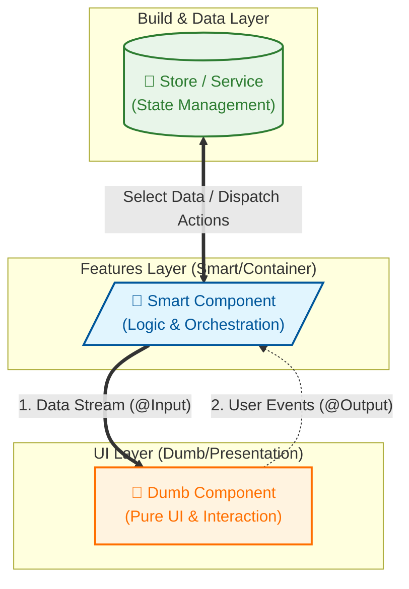
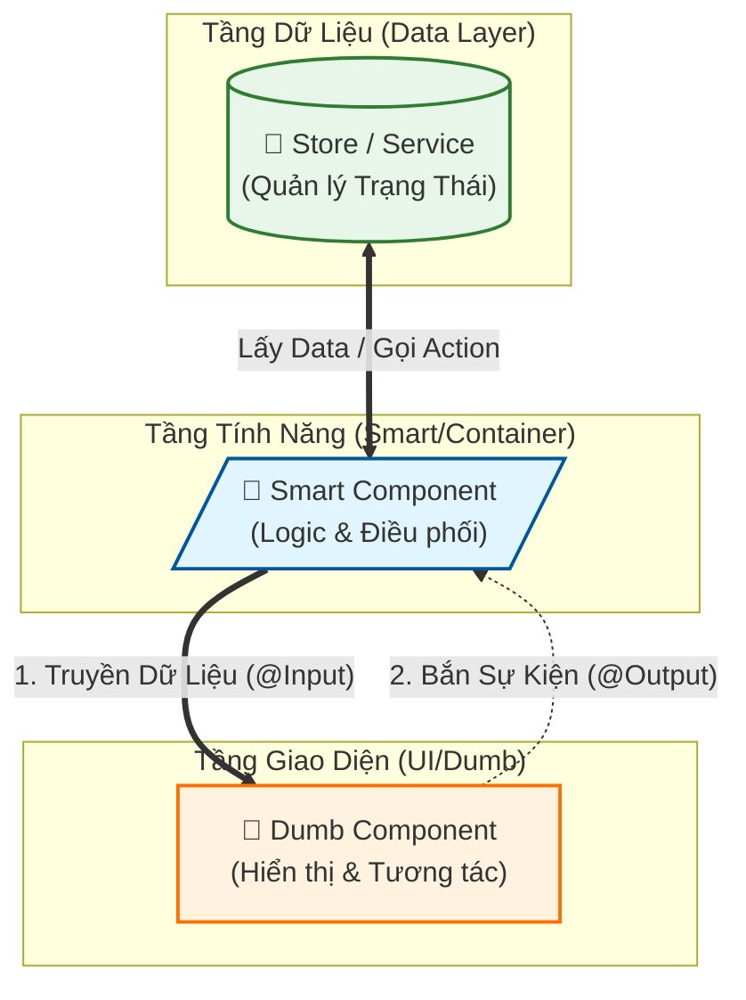

# Phase 2: Component Decoupling (Smart/Dumb)

**Goal:** Achieve separation of concerns by removing State Logic from UI Components.

## 🏛️ Smart (Container) vs Dumb (Presentation) Components



### 📋 Comparison Table

| Feature | Smart / Container Component | Dumb / Presentational Component |
| :--- | :--- | :--- |
| **Role** | **"The Brain"** (Manages & Orchestrates) | **"The Face"** (Displays & Interacts) |
| **Data Source** | Injects **Service / Store** to get data. | Receives data from parent via **`@Input()`**. |
| **Event Handling** | Calls Service/Store methods to mutate data. | Emits events via **`@Output()`**. |
| **Dependencies** | Tightly coupled to backend, store, router. | **Independent**. Knows nothing of Store. Only Inputs/Outputs. |
| **Reusability** | Low (Bound to business logic). | **High** (Can be used anywhere with correct inputs). |
| **Location** | Usually in `features/`. | Usually in `ui/`. |

**Principals:**
1.  **Smart Component (Container):**
    *   Injects dependencies (Store, Service, Router).
    *   Passes data down to Dumb components via `[property]`.
    *   Listens to events from Dumb components via `(event)`.
2.  **Dumb Component (UI):**
    *   No dependencies on the rest of the app.
    *   Only uses `@Input()` for data and `@Output()` for communication.
    *   Responsible for rendering and capturing user input.

## Checklist
- [x] **Employee Module Refactor**
    - [x] **Modify** `EmployeeFormComponent`:
        - [x] Remove `EmployeeStore` injection.
        - [x] Add `@Input() employee: Employee`.
        - [x] Add `@Input() isSaving: boolean`.
        - [x] Add `@Output() save: EventEmitter`.
    - [x] **Create** `EmployeeFormContainer` (`features/employee-manage/features/employee-form-container`):
        - [x] Inject `EmployeeStore`.
        - [x] Subscribe to Store Signals.
        - [x] Render `app-employee-form`.
    - [x] **Update Routes**: Point to `EmployeeFormContainer`.

- [x] **Designation Module Refactor**
    - [x] Apply same pattern to `DesignationFormComponent`.

## 🏗️ Agreed Directory Structure (DDD / Feature-First)


src/app/features/employee-manage/
├── data-access/              # (Tầng Dữ Liệu - Core Logic)
│   ├── models/               # Interfaces (Employee, etc.)
│   ├── services/             # API Services
│   └── store/                # State Management (EmployeeStore)
│
├── features/                 # (Tầng Smart Component - "Bộ não")
│   ├── employee-list/        # Container hiển thị danh sách
│   │   └── employee-list.component.ts (Kết nối Store <-> UI Table)
│   ├── employee-edit/        # Container trang sửa (hoặc FormContainer)
│   │   └── employee-edit.component.ts (Kết nối Store <-> UI Form)
│   └── ...
│
├── ui/                       # (Tầng Dumb Component - "Gương mặt")
│   ├── employee-table/       # Component chỉ hiển thị bảng (nhận input data=[])
│   │   └── employee-table.component.ts
│   ├── employee-form/        # Component chỉ hiển thị form (nhận input employee, bắn output save)
│   │   └── employee-form.component.ts
│   └── ...
│
└── employee-manage.routes.ts # Cấu hình route trỏ vào folder 'features/'

```text
src/app/features/employee-manage/
├── data-access/
│   ├── models/
│   │   ├── employee/         # employee.model.ts, requests...
│   │   ├── department/
│   │   └── designation/
│   ├── services/
│   │   ├── employee/         # employee.service.ts
│   │   ├── department/
│   │   └── designation/
│   └── store/
│       ├── employee/         # employee.store.ts
│       ├── department/
│       └── designation/
│
├── features/                 # Smart Components (Containers)
│   ├── employee/
│   │   ├── employee-list/
│   │   └── employee-form-container/
│   ├── department/
│   │   └── department-list/
│   │   └── ...
│   └── designation/
│       └── ...
│
├── ui/                       # Dumb Components (Pure UI)
│   ├── employee/
│   │   ├── employee-form/
│   │   └── employee-table/ (if applicable)
│   ├── department/
│   │   └── department-form/
│   └── designation/
│       └── designation-form/
```

---

# 🇻🇳 Phase 2: Tách Biệt Component (Smart/Dumb) (Tiếng Việt)

**Mục tiêu:** Đạt được sự phân tách mối quan tâm bằng cách loại bỏ Logic Trạng Thái (State Logic) khỏi UI Components.

## 🏛️ Smart (Container) vs Dumb (Presentation) Components



### 📋 Bảng So Sánh Chi Tiết

| Đặc điểm | Smart / Container Component | Dumb / Presentational Component |
| :--- | :--- | :--- |
| **Vai trò** | **"Bộ não"** (Quản lý & Điều phối) | **"Gương mặt"** (Hiển thị & Tương tác) |
| **Dữ liệu từ đâu?** | Inject **Service / Store** để lấy data. | Nhận data từ cha thông qua **`@Input()`**. |
| **Xử lý sự kiện** | Gọi các hàm của Service/Store để thay đổi data (Update, Delete). | Bắn sự kiện ra ngoài qua **`@Output()`** (Click, Form Submit). |
| **Sự phụ thuộc** | Phụ thuộc chặt chẽ vào backend, store, router. | **Độc lập**. Không biết Store là gì. Chỉ biết Inputs/Outputs. |
| **Tái sử dụng** | Thấp (Vì gắn liền với logic nghiệp vụ). | **Cao** (Có thể dùng ở bất cứ đâu nếu truyền đúng Input). |
| **Vị trí** | Thường nằm ở `features/`. | Thường nằm ở `ui/`. |

**Nguyên tắc cốt lõi:**
1.  **Smart Component (Container):**
    *   Inject các thư viện (Store, Service, Router).
    *   Truyền dữ liệu xuống Dumb component qua `[thuộc_tính]`.
    *   Lắng nghe sự kiện từ Dumb component qua `(sự_kiện)`.
2.  **Dumb Component (UI):**
    *   Độc lập, không phụ thuộc vào hệ thống bên ngoài.
    *   Chỉ dùng `@Input()` nhận dữ liệu và `@Output()` để gửi tín hiệu.
    *   Chịu trách nhiệm hiển thị đẹp và bắt thao tác người dùng.

## Danh sách kiểm tra (Checklist)
- [ ] **Refactor Module Employee**
    - [ ] **Sửa đổi** `EmployeeFormComponent`:
        - [ ] Xóa inject `EmployeeStore`.
        - [ ] Thêm `@Input() employee: Employee`.
        - [ ] Thêm `@Input() isSaving: boolean`.
        - [ ] Thêm `@Output() save: EventEmitter`.
    - [ ] **Tạo** `EmployeeFormContainer` (`features/employee-manage/features/employee-form-container`):
        - [ ] Inject `EmployeeStore`.
        - [ ] Subscribe vào Store Signals.
        - [ ] Render `app-employee-form`.
    - [ ] **Cập nhật Routes**: Trỏ đến `EmployeeFormContainer`.

- [ ] **Refactor Module Designation**
    - [ ] Áp dụng mô hình tương tự cho `DesignationFormComponent`.
