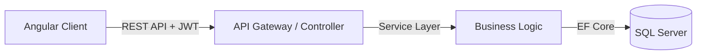

<div align="center">

# 🏢 Project Employee Management (Full Stack)

[](https://angular.io/)
[](https://dotnet.microsoft.com/)
[](https://www.microsoft.com/sql-server)
[](LICENSE)
[]()

**A comprehensive Enterprise Solution for Human Resource Management.**
*Modern Frontend Architecture • High-Performance Backend API • Scalable Database Design*

[Frontend](#-frontend) • [Backend](#-backend) • [Architecture](#-architecture) • [Getting Started](#-getting-started)

</div>

---

## 🌟 Introduction

**Project Employee Management** is a full-stack enterprise application designed to demonstrate a production-ready architecture. It bridges the gap between modern frontend frameworks and robust backend services, focusing on:

- **Scalability**: Designed to handle thousands of records with pagination and optimized querying.
- **Maintainability**: Strict separation of concerns (Clean Architecture).
- **Security**: JWT Authentication, Role-based access control (RBAC), and SQL Injection prevention.

## 🏗️ System Architecture

The solution relies on a micro-service inspired monolithic design:



| Component | Technology | Highlights |
| :--- | :--- | :--- |
| **Frontend** | Angular 21 | Signal Store, Standalone Components, Ant Design. |
| **Backend** | .NET 8 Web API | Entity Framework Core, Repository Pattern, AutoMapper. |
| **Database** | SQL Server | Normalized Schema, Indexes, Stored Procedures. |

---

## 🎨 Frontend (FE)

The frontend is built with **Angular 21**, emphasizing **Strict Mode** and **Signal-based State Management**.

- **Location**: [`./FE/employee_manage_app`](./FE/employee_manage_app)
- **Key Features**:
    - **Signal Store**: No Redux boilerplate, pure reactive signals.
    - **Smart/Dumb Components (Refactored)**: Strict separation of UI (presentation) and Logic (data access). Phase 2 Completed.
    - **Enterprise UX**: Skeleton loaders, Optimistic UI, Toasts with `ngx-toastr`.
    - **Performance**: OnPush strategy everywhere, optimized bundle size.

👉 **[Explore Frontend Documentation](./FE/employee_manage_app/README.md)**

---

## ⚙️ Backend (BE)

The backend provides a robust RESTful API using **.NET 8**.

- **Location**: [`./BE`](./BE)
- **Key Features**:
    - **Clean Architecture**: Domain, Application, Infrastructure layers.
    - **Performance**: Async/Await, Caching, Optimized LINQ queries.
    - **Security**: JWT Bearer Token, CORS policies.

---

## 🚀 Getting Started (Full Stack)

### 1. Database Setup
1. Open **SSMS** (SQL Server Management Studio).
2. Execute the script in `./database/script.sql` to create the schema and seed data.

### 2. Backend Setup
```bash
cd BE/Employee.api
dotnet restore
dotnet run
```
API will run at `http://localhost:5000`.

### 3. Frontend Setup
```bash
cd FE/employee_manage_app
npm install
ng serve
```
Application will run at `http://localhost:4201`.

---

## 📚 Documentation Hub

We maintain detailed documentation for every aspect of the system:

| Document | Description |
| :--- | :--- |
| [**System Flow**](./ARCHITECTURE_AND_FLOW.md) | High-level system design and data flow diagrams. |
| [**Integration Guide**](./INTEGRATION_GUIDE.md) | How FE and BE communicate. |
| [**Frontend Architecture**](./FE/employee_manage_app/update_core/core/architecture/architecture_excellence.md) | **Must Read**: The "Excellent" standard we follow. |
| [**Upgrade Roadmap**](./FE/employee_manage_app/update_core/core/architecture/phased_upgrade_plan.md) | Future plans for 2026. |

---

<div align="center">
  <sub>Copyright © 2026. All rights reserved.</sub>
</div>