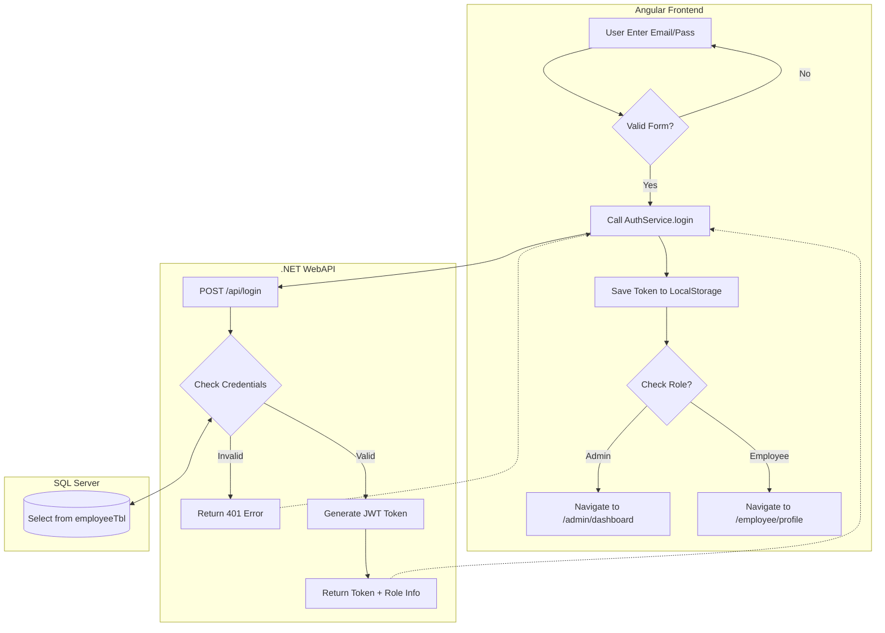
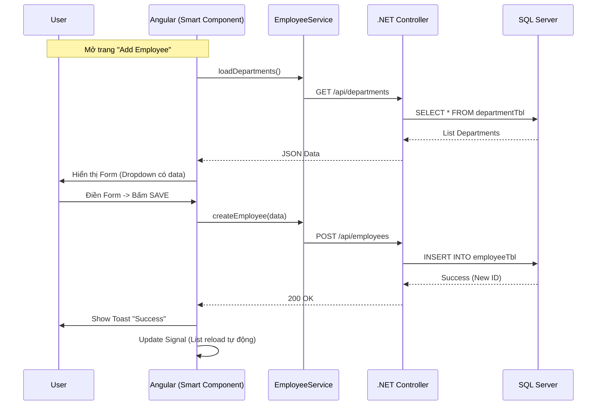

Chào bạn, **Mentor Angular** đây.

Với vai trò Tech Lead, khi vẽ Flowchart, chúng ta không vẽ "cho vui". Chúng ta vẽ để hình dung **Luồng dữ liệu (Data Flow)** và **Luồng nghiệp vụ (Business Logic)** đi qua các tầng (User -> Angular -> API -> Database).

Dựa trên Database chúng ta vừa chốt (có `email`, `password`, `role`), tôi sẽ vẽ cho bạn **2 Flowchart quan trọng nhất** của dự án này để bạn đưa vào tài liệu.

---

### 1. FLOWCHART ĐĂNG NHẬP & PHÂN QUYỀN (Login & RBAC)

Đây là luồng xương sống. Nếu luồng này sai, toàn bộ app mất bảo mật.

**Logic:**

1. User nhập liệu.
2. Angular gọi API.
3. API check DB.
4. Nếu đúng -> Trả về Token + Role.
5. Angular lưu Token -> **Guard** kiểm tra Role -> Điều hướng (Admin vào trang Admin, Employee vào trang User).

**Mã Mermaid (Copy vào file Markdown hoặc Draw.io):**

---

### 2. FLOWCHART THÊM MỚI NHÂN VIÊN (Create Employee)

Luồng này thể hiện logic CRUD và mối quan hệ giữa các bảng (Department/Designation).

**Logic:**

1. Trước khi mở form thêm mới, phải tải danh sách Phòng ban & Chức vụ (Dropdown).
2. Điền Form.
3. Lưu -> Backend Insert -> Trả kết quả.
4. Angular cập nhật UI (dùng Signals) không cần F5.

**Mã Mermaid:**

---

### 3. PROMPT CHO AI KHÁC (Để vẽ đẹp hơn)

Nếu bạn muốn dùng công cụ AI khác vẽ cho "nghệ thuật" (như Whimsical, Miro AI), hãy dùng prompt này:

> **Prompt:**
> "Create a swimlane flowchart for an Employee Management System Login process.
> * **Lane 1 (User):** Enters credentials on Login Screen.
> * **Lane 2 (Angular Frontend):** Validates form, sends POST request to API. Handles success (stores token) or error (shows message). Checks User Role to redirect (Admin vs Employee).
> * **Lane 3 (.NET API):** Receives request, queries Database. Generates JWT Token if valid.
> * **Lane 4 (Database):** Verifies email/password in `employeeTbl`.
> Show decision diamonds for 'Is Valid?' and 'Check Role'."
> 
> 

---

### BÀI TẬP TECH LEAD (NEXT STEP)

Bạn đã có **Database Schema** (dữ liệu) và **Flowchart** (logic). Bây giờ chúng ta bắt đầu code Angular.

Hãy tạo file **Environment** và **Services** đầu tiên.

1. Tạo `src/environments/environment.ts`: Khai báo `apiUrl`.
2. Tạo `src/app/core/services/auth.service.ts`.

**Câu hỏi cho bạn:**
Trong Flowchart 1, sau khi API trả về Token, theo bạn **chúng ta nên lưu Token vào đâu?**

* A. `LocalStorage`
* B. `SessionStorage`
* C. `Cookies (HttpOnly)`
* D. Biến trong Service (Memory)

*Gợi ý:* Cách A dễ nhất (tutorial hay dùng), nhưng cách C mới là bảo mật nhất (tránh XSS). Bạn chọn cách nào để triển khai?